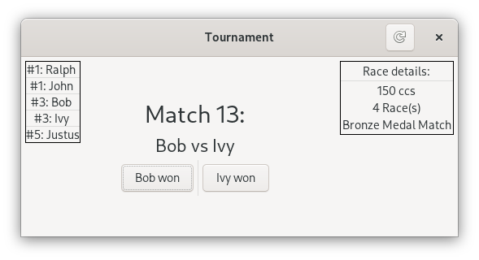

# tournament
## Purpose
5 is an awkward number --- especially when you want to play Mario Kart with only one set of controllers!
This small GTK3 application allows you to manage 5-player Mario Kart tournaments where only two people race at a time. 
The tournament format consists of a group stage, a tiebreaker stage (if needed), a semifinal stage, a bronze-medal match, and a gold-medal match.

## Compiling and Running
This program requires GTK3. Compile and run the program with `cargo run "Player 1 Name" "Player 2 Name" "Player 3 Name" "Player 4 Name" "Player 5 Name"`.
## License
Licensed under either of

 * Apache License, Version 2.0, ([LICENSE-APACHE](LICENSE-APACHE) or http://www.apache.org/licenses/LICENSE-2.0)
 * MIT license ([LICENSE-MIT](LICENSE-MIT) or http://opensource.org/licenses/MIT)

at your option.
